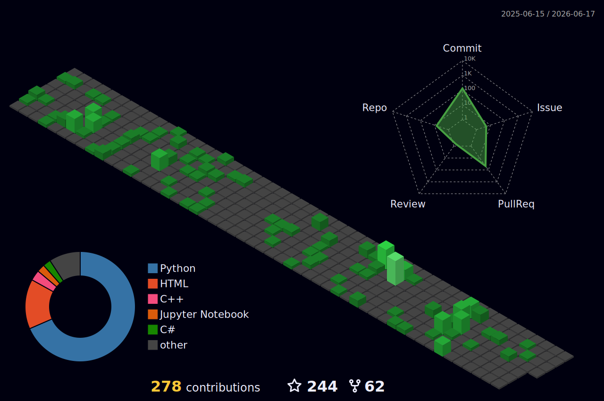

# Antoine Boucher
**Engineer** · Open Source · Montréal, Canada

I’m interested in computer graphics pipelines, physics-based rendering, and generative AI for game development. I like building interactive media projects, working with motion capture, and using AI to create fun and engaging experiences.

## Links

> If you’re looking for collaboration or want to discuss a project, antoine@antoineboucher.info

---

## Tech I use a lot

---

## Featured projects

  
AlgoÉTS · pinned repos · integrations / forks

   

### AlgoÉTS
Open-source + student community projects (trading / tooling / automation):

### Integrations / forks

---

## Now playing (Spotify)

---

## 3D contribution calendar

Night green theme from [github-profile-3d-contrib](https://github.com/yoshi389111/github-profile-3d-contrib); SVGs are committed by [this workflow](.github/workflows/github-profile-3d-contrib.yml).

---

## Stats

  
<b>📈 GitHub</b>

   

  

    

  

  
<b>⏱️ WakaTime</b>

   

  <!-- If your WakaTime username is different, update it below -->
  

    

  <!-- Toronto is UTC-5 (winter). Adjust if needed. -->
  

  
<b>LeetCode</b>

   

  <!-- LEETCODE_STATS_START -->
  
  
  
  
  <!-- LEETCODE_STATS_END -->

